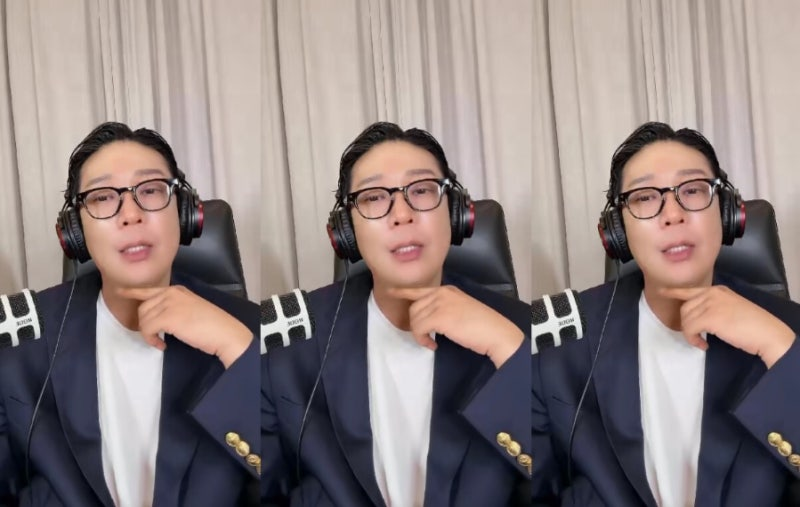
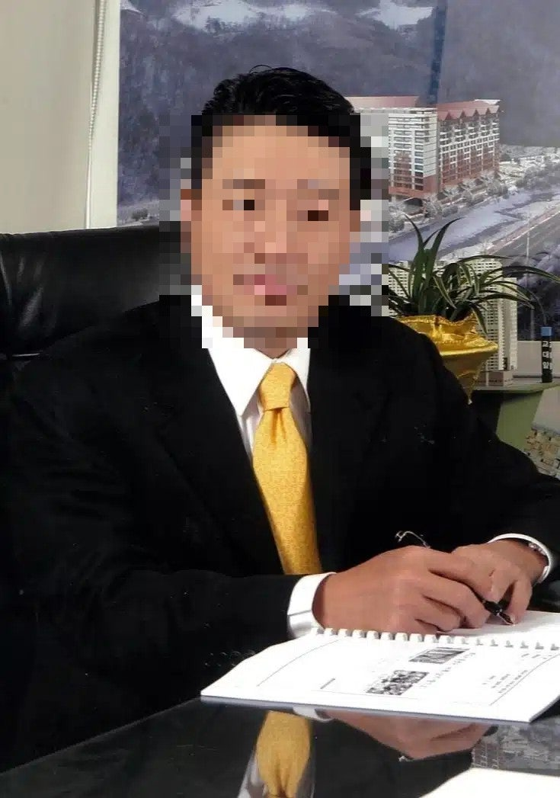
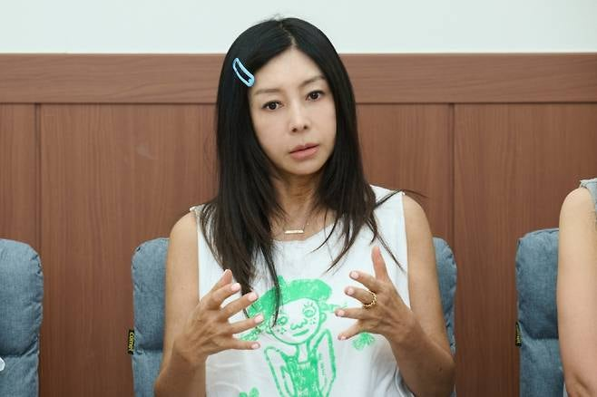
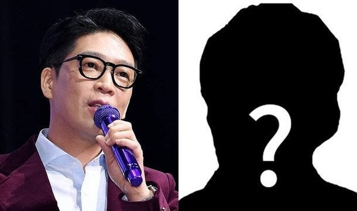
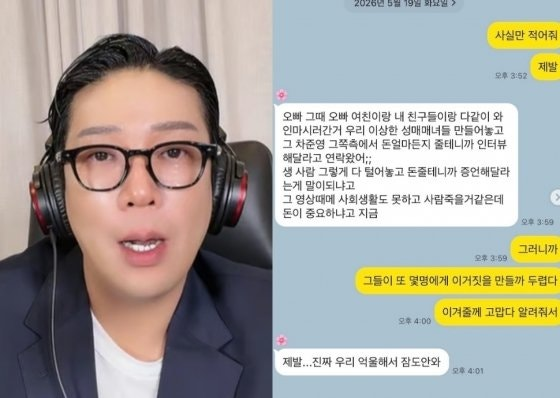

# MC몽이 라방에서 지목한 차준영 황신혜 안계상…도대체 무슨 일? (연예뉴스)

> 찌롱 · 2026-05-20

원문: https://blog.naver.com/euene1111/224291295961

> MC몽이 라방에서 지목한 차준영 황신혜 안계상…도대체 무슨 일? (연예뉴스)

지난 5월 18일, 가수 MC몽이 틱톡 라이브 방송을 켜면서 연예계가 발칵 뒤집혔다. 단순한 해명 방송으로 시작됐지만 방송이 이어질수록 실명이 쏟아지기 시작했고, 차준영·황신혜·안계상이라는 이름이 연달아 언급되면서 실시간 검색어를 장악했다. 다만 이 글에서 다루는 내용은 대부분 MC몽의 일방적인 주장을 바탕으로 한 것이며, 현재까지 공식적으로 확인된 사실은 없다는 점을 먼저 밝혀둔다!

발단 — MC몽은 왜 라이브를 켰나

MC몽은 2023년 차가원 회장과 함께 엔터테인먼트 회사 원헌드레드를 공동 창업했다가 지난해 5월 사실상 쫓겨났다. 본인 말로는 차가원이 단체 메신저에서 공개적으로 업무 배제를 선언했다고 하는데, 이후 원헌드레드는 사방에서 불이 붙기 시작했다.

​

이승기, 이무진, 비비지, 첸백시 등과 정산 분쟁이 터졌고, 더보이즈 멤버들은 차가원을 횡령 혐의로 고소했다. 팬플랫폼 노머스도 사기 혐의로 고소에 가세했다. 그리고 MBC PD수첩이 MC몽의 회사 자금 횡령·불법 도박 의혹을 취재하기 시작했다.

MC몽 입장에서는 "차가원·차준영 측이 나를 매장하려고 PD수첩에 허위 제보를 넣었다"는 것이고, 이에 정면 돌파를 선택한 게 이번 라이브였다.

차준영은 누구인가

이번 사태의 핵심 인물로 언급된 차준영은 차가원 회장의 작은아버지로, 아이유·손흥민 등 탑스타들이 분양받아 화제가 됐던 초고가 아파트 에테르노 청담·압구정의 시행사 넥스플랜 회장이다.

​

겉으로는 화려한 이력이지만 속사정이 복잡하다. 파주 통일동산 개발 사업 실패로 5,000억 원이 넘는 배상 판결을 받으면서 통장이 전부 압류된 상태였는데, 친형 명의 통장을 빌려 연예인들의 분양 대금을 사적으로 유용했다는 의혹으로 현재 경찰 수사를 받고 있다. 미국 영주권자이자 국내 카지노 VVIP로도 알려져 있다.

MC몽은 이 사람을 이번 사태의 핵심 배후로 지목했다. 본인의 엘리베이터 CCTV 사진을 성매매 의혹으로 둔갑시킨 장본인이 차준영이라고 주장했고, "도박에 미친 사람이 자기는 라스베이거스에서 도박 모임을 하면서 나한테 없는 의혹을 뒤집어씌웠다"고 격하게 분노를 쏟아냈다. 다만 이는 어디까지나 MC몽 측의 주장이며, 차준영 측의 공식 입장은 현재까지 나오지 않은 상태다.

​

황신혜 — 가장 충격적이었던 폭로

이날 방송에서 가장 큰 파장을 일으킨 건 황신혜 관련 발언이었다. MC몽은 차준영을 언급하면서 두 사람이 오랜 기간 비밀 연애를 해왔다고 주장했고, 황신혜 딸 이진이까지 언급하며 수위 높은 이야기를 이어갔다.

​

황신혜는 1980~90년대를 대표하는 톱배우로, '컴퓨터 미인'이라는 별명이 붙을 만큼 당대 독보적인 존재였다. 최근까지도 딸 이진이와 함께 방송에 출연하며 워너비 모녀로 사랑받고 있었는데, 갑작스럽게 이름이 언급되면서 온라인이 들썩였다.

그러나 황신혜 측은 현재까지 아무런 공식 입장을 내놓지 않고 있으며, MC몽이 방송에서 한 발언들은 사실로 확인된 것이 없다. 온라인에서도 "실명 언급 수위가 너무 세다", "증거 없는 폭로는 위험하다"는 반응이 상당히 나오고 있는 상황이다.

안계상 — 차준영의 측근으로 지목

안계상은 이번 사태 전까지 대중에게 거의 알려지지 않았던 인물이다. 나무위키에 문서조차 없었는데 이번 라이브 이후 갑자기 실검에 오르면서 관심을 받고 있다.

​

MC몽은 방송에서 안계상을 차준영의 최측근으로 지목하며, 미국에서 공익제보자 타이틀로 MBC PD수첩에 제보해 자신을 무너뜨리려 했다고 주장했다. 또한 수십억 원대 판돈이 오가는 사설 불법 도박 바둑이 모임의 고정 멤버로도 실명을 거론했다. 이 역시 MC몽의 주장일 뿐이며, 안계상 측의 공식 반박이나 입장은 확인되지 않고 있다.

김민종·도박 모임까지 이어진 폭로

배우 김민종도 실명으로 거론됐다. MC몽은 김민종이 차준영에게 롤스로이스 슈퍼카와 돈을 받고, 바둑이 도박 모임에 참여하며 수천만 원대 팁을 받았다고 주장했다. 성매매 의혹도 제기하며 "녹취와 문자 기록이 있다, 고소하면 공개하겠다"고 했다.

​

이에 대해 김민종 측은 즉각 "명백한 허위사실"이라며 법적 대응을 선언했다. 이 외에도 현재 복역 중인 가수 김호중의 전 소속사 대표가 마카오에 매달 거액을 들고 가 도박을 하고 있다고 폭로했고, 왕성하게 활동 중인 유명 MC와 글로벌 스타 등 추가 인물도 암시하며 "고소하면 2부 라이브를 진행하겠다"고 경고했다.

이번 사태는 단순 연예 이슈를 넘어 재계·언론·법조계까지 얽힌 복잡한 구도로 번지고 있다. 하지만 현재까지 방송에서 나온 내용의 대부분은 MC몽의 일방적 주장이고, 물증이 공개된 것은 없다. 김민종 측만 공식 반박했고 나머지는 대부분 침묵 중이다.

​

MC몽은 "고소하면 2부 라이브로 간다"며 강경한 태도를 유지하고 있어 법적 공방이 본격화될 가능성이 높다. 사실 여부는 앞으로의 추가 입장과 수사 결과를 지켜봐야 할 것 같다.

#MC몽
