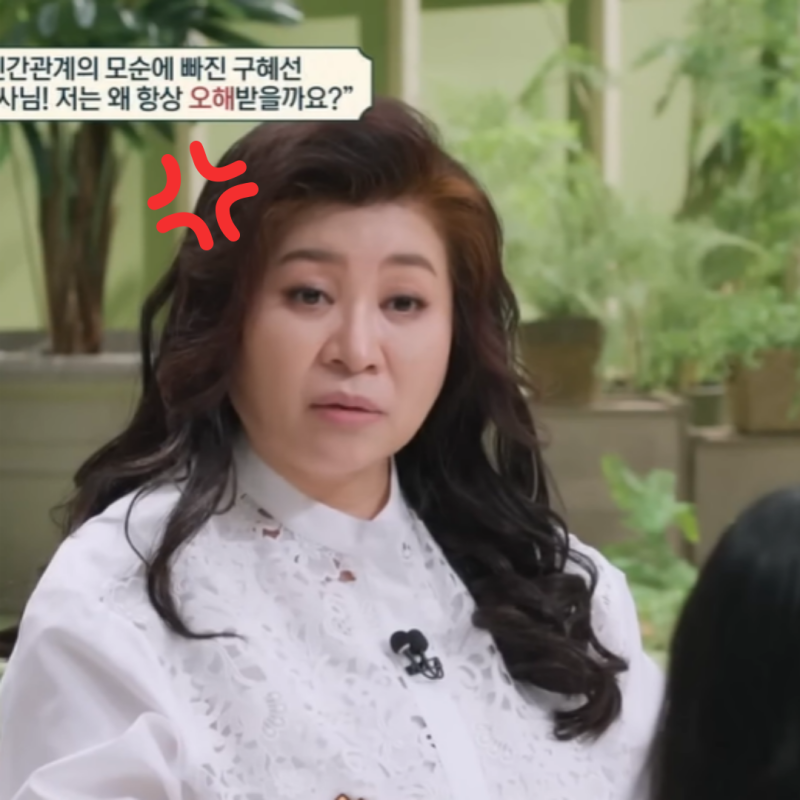
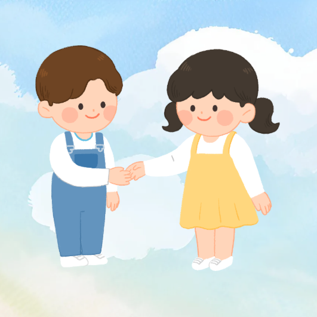
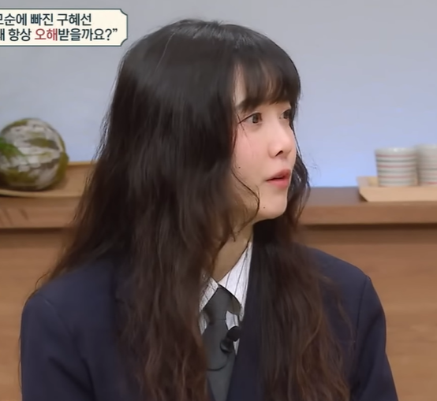

# '구혜선씨가 친구가 없는 이유는요..' 오은영 정색하고 팩폭했다

> 방구석 유학파 · 2026-05-18

원문: https://blog.naver.com/gurwn1725/224289312532

> '구혜선씨가 친구가 없는 이유는요..' 오은영 정색하고 팩폭했다

사람이 나쁘지 않은데 이상하게 오해를 자주 사는 사람이 있어요. 본인은 분명 나쁜 뜻이 아니었는데 상대는 기분이 상하고, 관계는 어색해지고, 시간이 지나면 사람들과 점점 멀어지게 되죠. 이번 이야기는 바로 그런 인간관계의 묘한 지점을 제대로 건드린 사례였어요.

​

> 직설이 아니라 돌려 말하는 사람들

가장 먼저 나온 이야기는 의사소통 방식이었어요.

​

오은영은 구혜선의 화법을 보면서 직접적으로 표현하지 않고 빙 돌아서 전달하는 경향이 있다고 봤습니다. 쉽게 말하면 본심을 그대로 말하지 않고 포장해서 전달하는 스타일이죠.

이런 유형 주변에 은근 많아요.

싫은데 괜찮다고 하고.

불편한데 아닌 척하고.

내 선택인데 남을 위한 선택처럼 말하고.

겉으로 보면 부드러워 보일 수 있어요. 직접적으로 상처 주지 않으려는 배려처럼 보일 수도 있고요.

그런데 문제는 상대가 묘하게 불편함을 느낀다는 거예요.

왜냐면 말 속에 숨은 진짜 의도가 어렴풋이 느껴지거든요.

대표적으로 방송에서 언급된 이야기가 있었죠. 촬영 준비 과정에서 많은 배우들이 청담동 숍을 들르는 루틴을 따르는데, 구혜선은 그렇게 하지 않았다고 해요.

본인은 이동 시간과 피로도를 고려한 선택이었다고 설명했어요. 충분히 이해되는 이유죠.

그런데 표현 방식이 문제였다는 겁니다.

오은영의 해석은 이랬어요. 그냥 솔직하게 ‘저는 그 시간이 아까워요’, ‘좀 더 쉬고 싶어요’라고 말하면 될 일을, 다른 사람을 위한 선택처럼 포장하면 듣는 입장에서는 이상하게 받아들일 수 있다는 거죠.

이게 왜 중요하냐면, 그런 표현은 은근히 다른 사람을 비교 대상으로 만들어버리기 때문이에요.

결국 상대 입장에서는 이렇게 들릴 수도 있죠.

‘그럼 우리는 배려가 없는 사람이라는 건가?’

본인은 그런 의도가 아니었어도 결과는 그렇게 흘러갈 수 있다는 이야기예요.

> 착한 말투가 꼭 좋은 소통은 아니더라고요

이 부분 보면서 꽤 공감됐어요.

​

사실 많은 사람들이 솔직한 표현을 어려워하잖아요. 직접 말하면 너무 차갑게 보일까 봐, 이기적으로 보일까 봐, 상대 기분 상할까 봐 돌려 말하게 되죠.

그런데 이상하게 돌려 말한 게 더 큰 오해를 만들 때가 있어요.

차라리 솔직한 한마디가 깔끔할 때가 많거든요.

‘오늘은 피곤해서 못 가겠어요.’

‘이건 제 방식이 더 편해요.’

‘그건 제가 원하지 않아요.’

이런 말은 순간적으로 차갑게 느껴질 수 있어도 관계를 꼬이게 만들진 않아요.

오히려 애매한 배려 화법이 사람을 더 피곤하게 만들죠.

> 친구 기준이 너무 높아도 외로워집니다

두 번째로 흥미로웠던 건 친구에 대한 기준이었어요.

​

구혜선은 친구가 되려면 비밀이 완벽하게 지켜져야 한다고 말했어요. 고민을 털어놨는데 그게 밖으로 새어나가면 안 되고, 완전히 신뢰할 수 있어야 친구라고 느낀다는 거죠.

듣자마자 틀린 말은 아니라는 생각이 들었어요.

누구나 믿을 수 있는 친구를 원하니까요.

그런데 오은영이 짚은 포인트는 조금 달랐습니다.

기준이 너무 완벽하면 현실에서는 남는 사람이 거의 없다는 거예요.

이게 진짜 핵심이었죠.

사람은 생각보다 완벽하지 않아요. 친구도 그렇고요.

내가 기대한 반응을 안 해줄 수도 있고, 공감 방식이 다를 수도 있고, 때론 내 마음을 정확히 이해 못 할 수도 있어요.

그런데 그때마다 ‘이 사람은 진짜 친구가 아니야’라고 결론 내리면 관계는 유지되기 어렵습니다.

친구는 시험 통과형 존재가 아니니까요.

> 상처받기 싫어서 먼저 선 긋는 사람들

이 부분은 생각보다 많은 사람들이 해당될 것 같아요.

​

겉으로는 ‘사람을 가려 사귀는 편이에요’라고 말하지만, 사실은 상처받기 싫어서 기준을 높여둔 경우가 있거든요.

실망하고 싶지 않아서.

배신당하고 싶지 않아서.

내 속마음을 들켰다가 후회하고 싶지 않아서.

그래서 사람을 가까이 안 두게 돼요.

처음엔 이게 현명한 선택처럼 느껴져요. 괜히 피곤한 인간관계 안 만들어도 되니까요.

그런데 시간이 지나면 묘한 외로움이 남습니다.

내 기준을 통과할 사람은 없고, 그렇다고 혼자가 완전히 편한 것도 아니고요.

오은영이 말한 것도 결국 이 부분이었어요.

친구에게 고민을 이야기하는 건 문제 해결을 맡기는 게 아니라 소통 자체의 의미가 있다는 것.

완벽한 반응을 기대하는 순간 관계는 숨이 막히게 된다는 이야기였죠.

> 오해받는 사람들의 공통점

이번 사례를 보면서 느낀 건 이거였어요.

​

오해를 자주 받는 사람들은 꼭 악의가 있어서가 아니더라고요.

오히려 나름의 방어 방식이 너무 강해서 그런 경우가 많아요.

직접 말하면 상처받을까 봐 돌려 말하고.

실망할까 봐 사람 기준을 높이고.

배신당할까 봐 가까워지지 않고.

본인을 지키기 위한 방식이었는데, 결과적으로는 사람을 밀어내는 구조가 되는 거죠.

이게 참 아이러니해요.

관계를 지키려고 만든 방식이 오히려 관계를 망가뜨리니까요.

결국 인간관계는 완벽한 사람 찾기가 아니라 조금씩 조율해가는 과정인지도 모르겠어요.

> 마무리하며

구혜선 편이 유독 인상 깊었던 건 특정 연예인의 성격 분석이 아니라 우리 주변에서도 흔히 볼 수 있는 관계 패턴을 보여줬기 때문이에요. 너무 돌려 말하는 습관, 너무 높은 기대치, 상처받기 싫어서 세운 벽이 오히려 사람을 멀어지게 만들 수 있겠죠.

​

여러분은 어떠신가요? 혹시 나도 모르게 관계를 어렵게 만드는 습관이 있었던 건 아닌지 한 번 떠올려보게 되네요. 공감되셨다면 공감 부탁드리고, 여러분 생각도 댓글로 나눠주세요.

> 놓치면 후회하는 글

​
