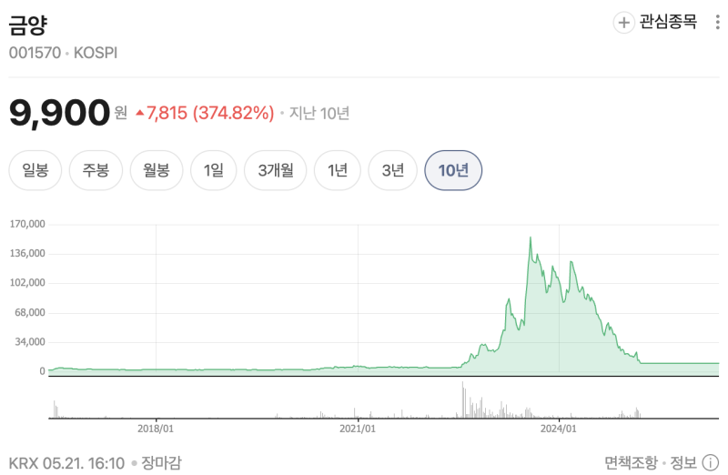
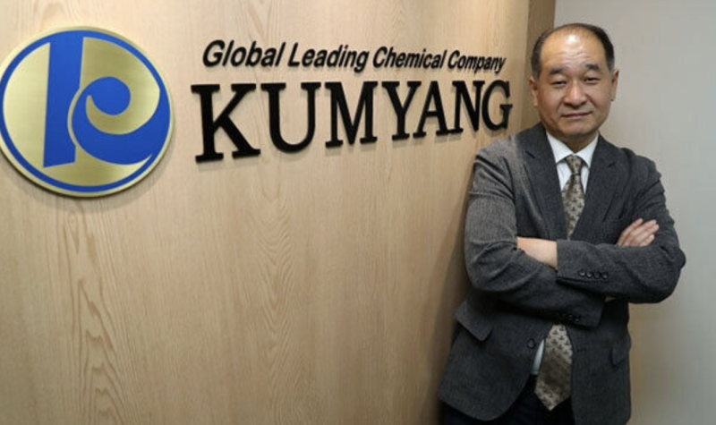
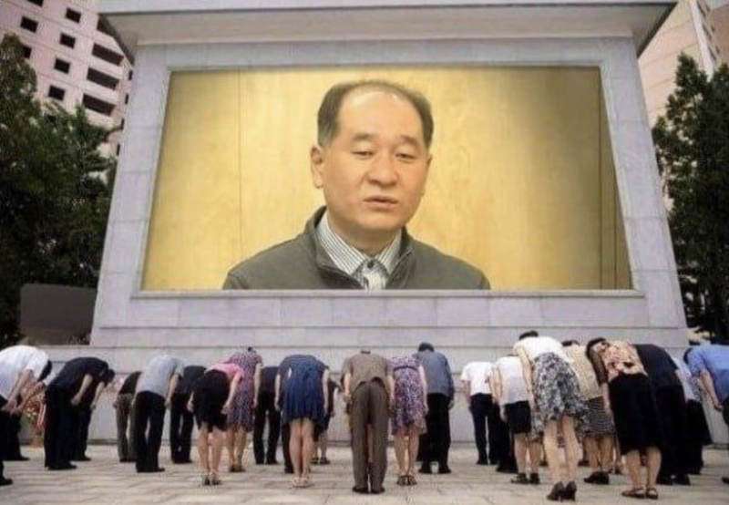
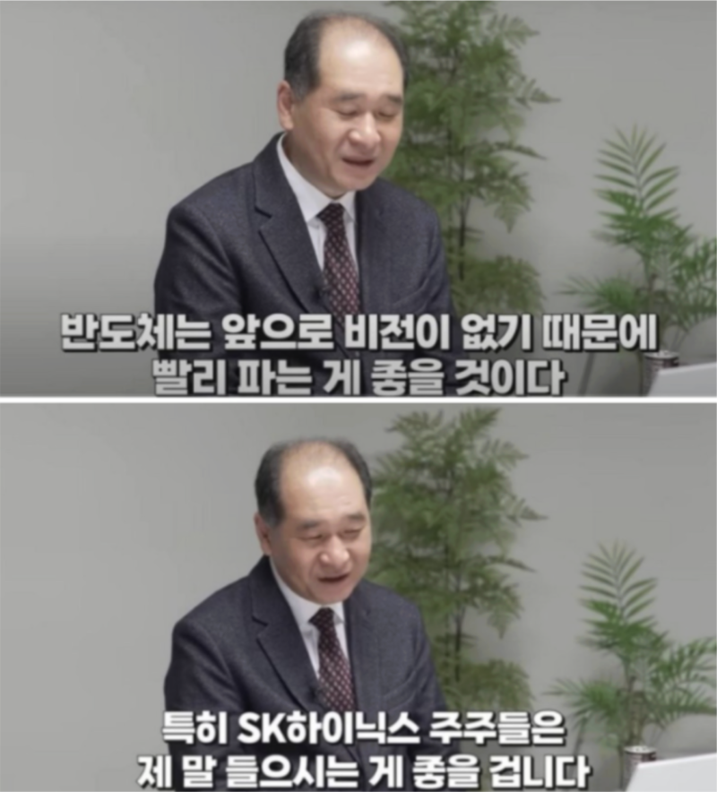
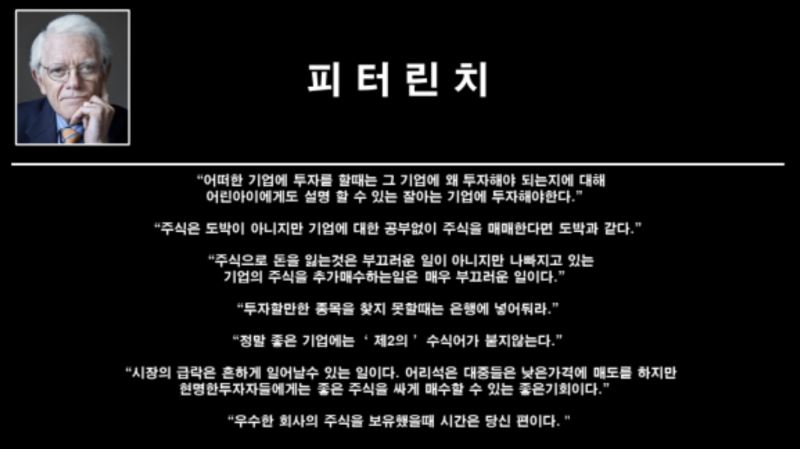

# "주식 상장폐지 됐다..." SK하이닉스 주주들 정신차리라고 무시하던 금양

> 비아이 · 2026-05-22

원문: https://blog.naver.com/loonshots88/224292918898

이런 불장에도 우울한 채 증권 앱을 열어보는 사람들이 있다고 합니다. 그 종목에는 매수 버튼도, 매도 버튼도 없었지요. 그 자리엔 두 글자만 있었습니다.

​

​

거래정지.

몇 달, 아니 몇 년 전만 해도 "이 종목은 다르다"고 믿었던 사람들이 그 두 글자 앞에서 아무것도 할 수 없었다고 하더군요.

손절도, 버티기도. 그냥 멍하니 화면만 바라볼 수밖에요.

바로, 금양 이야기입니다.

한때 시가총액이 10조원에 육박했던 이 회사는 1978년 설립된 발포제 및 정밀화학 기업이었습니다.

​

그러다 2020년대 이차전지 붐과 함께 전혀 다른 무언가가 됐습니다. 주가는 날로 치솟았고, 커뮤니티에서는 온갖 찬양론자들로 들끓었지요.

그 중심에는 누가 있었을까요.

​

이른바, '배터리 아저씨'가 있었습니다.

이차전지 전문가를 자처하며 금양을 비롯한 관련 이차전지 종목을 열정적으로 추천했던 인물입니다. 그의 영상엔 수십만 명이 몰렸습니다.

댓글엔

"덕분에 샀습니다."

"믿고 갑니다."

등 온갖 찬양하는 느낌이 쏟아졌었지요.

​

즉, 그의 욕망이 담긴 이야기에 사람들은 그 이야기를 따라 거부감 없이 투자를 감행했다.

철학자 르네 지라르는 인간의 욕망은 본래 자발적이지 않다고 했습니다.

​

우리는 무언가를 직접 원하는 게 아니라, 타인이 원하는 것을 원하게 된다. 욕망엔 반드시 중개자가 존재한다는 것이지요.

배터리 아저씨는 그 중개자였습니다.

​

그가 이차전지 주식에 투자를 원하는 것처럼 보였고, 수만 명이 그 욕망을 따라갔습니다. 이것에 테마주 광풍의 결말이지요. 종목의 실체보다는 욕망에 전염되어 먼저 행동으로 이어지게 되는...

문제는 그 욕망이 퍼지는 속도만큼 경고 신호도 있었다는 점이에요.

금양은 2024년 감사보고서에 이미 외부 감사인으로부터 의견거절을 받았습니다. 회사의 재무 정보를 확인할 수 없다는 뜻이지요.

이것은 결코 작은 주석이 아니었습니다. 상장폐지 사유가 발생한 것이었어요.

심지어 SK하이닉스 주식을 비롯한 반도체 관련주를 당장 팔고 이차전지로 넘어오라고 했었던.....

철학자 카를 포퍼는 진정한 지식은 반증 가능성 위에 선다고 했습니다.

​

어떤 정보가 참인지 알고 싶다면, 그것이 틀릴 수 있는 조건을 먼저 살펴봐야 한다는 거예요. 그러나 강한 믿음 앞에서 인간의 뇌는 반증 신호를 처리하지 않으려고 하잖아요.

심리학에선 이를 확증 편향이라고 부릅니다.

이 회사는 다르다는 믿음이 굳어지면, 감사의견 거절이라는 분명한 경고도 일시적인 문제로 축소되는 거지요.

2025년, 금양은 두 번째 의견거절을 받았습니다. 2년 연속이었어요. 그리고 한국거래소는 상장폐지를 의결했습니다.

테마주의 비극은 반복됩니다.

​

이차전지 이전엔 바이오가 있었고, 바이오 이전엔 또 다른 무언가가 있었지요. 매번 "이번엔 다르다"는 말이 먼저 나오고, 거래정지 문자가 나중에 오는게 현실입니다.

항상 과정은 비슷하더라고요.

욕망을 중개하려는 사람이 여기저기서 등장하고, 사람들이 우르르 따라가고, 뒤늦게 튀어나오는 경고는 묻히게 되는...

가장 문제는 배터리 아저씨입니다. 분명 금양 홍보 이사 타이틀을 달고 금양에 대한 기업의 현실에 대해서 누구보다 잘 알고 있었을 테니까요. 그런데도 사람들에게 지속적으로 관련 이차전지 주식을 추천해줬으니...

그나마 다른 이차전지주들은 긴 인고 끝에 반등했지만, 정작 본인이 홍보 이사로 있던 금양은 상폐를 당하게 되었습습니다.

하지만 배터리 아저씨를 탓하는 것만으로는 부족합니다.

그 욕망을 빌려 쓴 것은 결국 우리 자신이었으니까요. 이번 사례가 아니더라도요. 유튜브 혹은 카페나 SNS 등에서 남이 추천해주는 종목만 투자해왔다면요.

​

지금이라도 내 판단으로 투자할 수 있도록 바꿔야만 합니다. 깨지더라도 내가 직접 결정한 주식으로 깨지는 것과 맹목적으로 남을 따라 산 주식으로 깨지는 것과는 차원이 다르거든요.

주식을 하다 보면 누구나 돈을 잃습니다. 저 역시 주식과 코인으로 큰돈을 잃어봤고요.

(비트코인 선물까지...ㅠㅠ)

그래도 그 과정에서 계속 무언가를 배우고 내 투자 원칙을 정립해가면서 시장에 계속 남아 있으니까 기회는 오긴 오더라고요.

다들, 힘내세요. 다시 일어설 수 있습니다!

​
