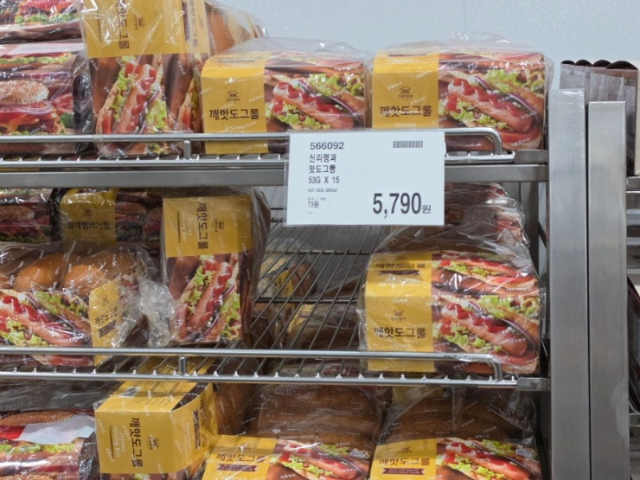
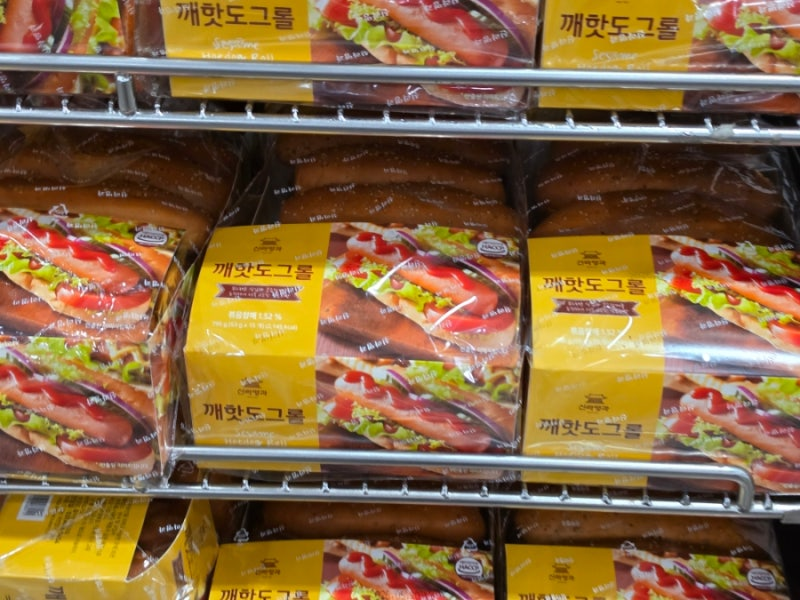
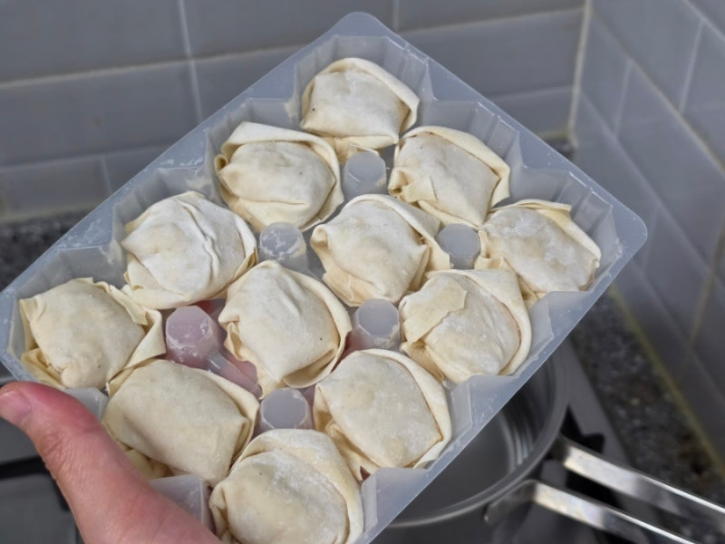
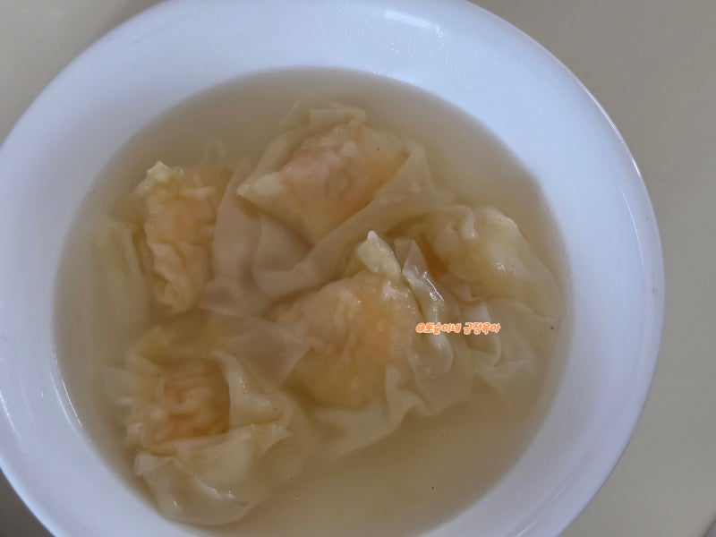
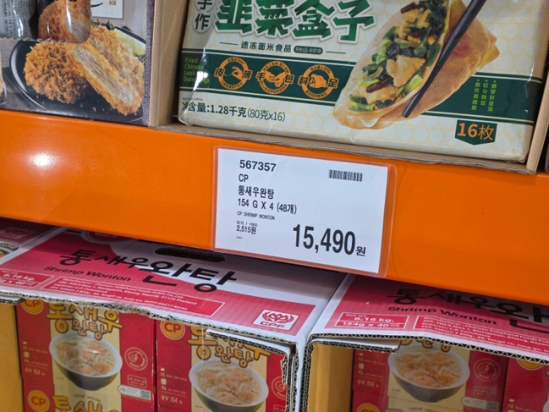
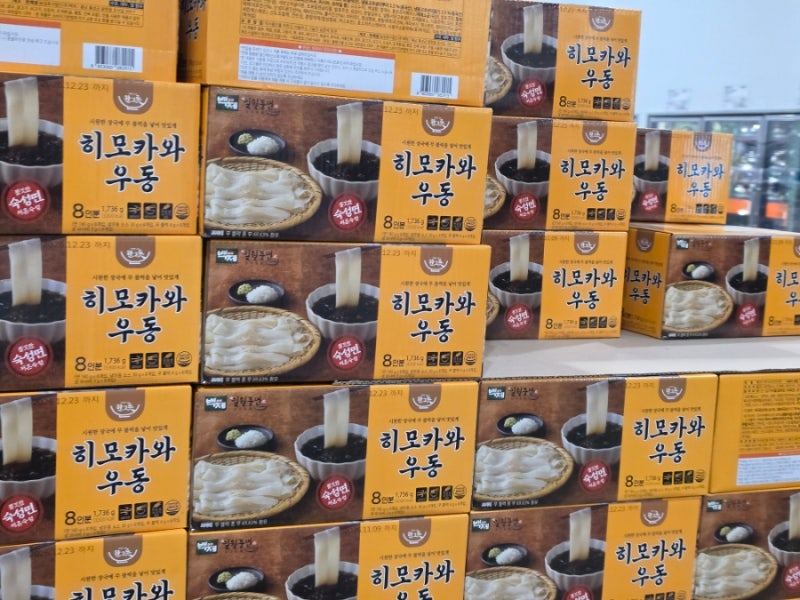
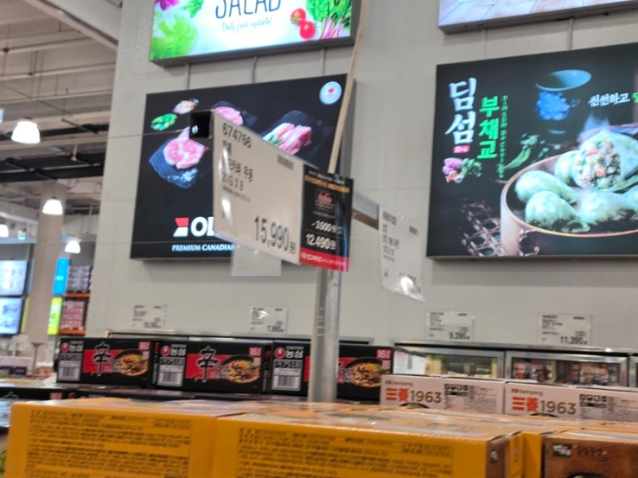
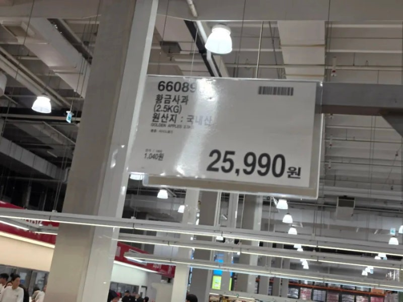
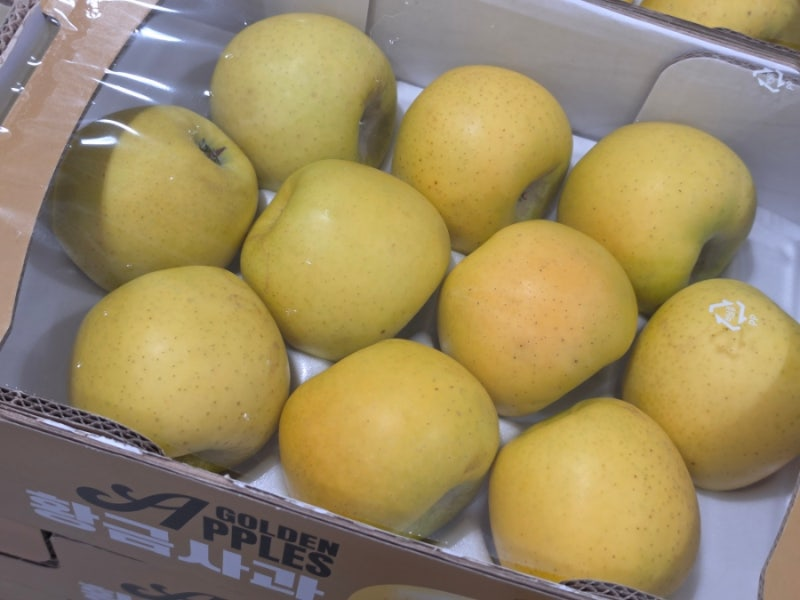

# 코스트코 '이것' 담지 않으면 절반은 손해! 아는사람만 담는 먹거리4

> 토순맘 · 2026-05-21

원문: https://blog.naver.com/rabbitmom_/224292595254

> 코스트코 먹거리 4가지
> 
> 찐단골이 알려드릴게요!

사실 코스트코가면 눈에 띄는 제품이

너무 많잖아요. 저도 맨날 베이커리

신상 뜨면 마구 사오는데요,

오래 다니다보니 회원권 뽕을 뽑는

여기만 있거나 , 가격이 너무

좋은템들이 정해져있더라고요.

제가 먹어보고 정리해봤어요.

​

이번 주말 새롭게 꼭 담아보세요~!

> 1. 신라명과 깨핫도그롤
> 
> 가격 : 5,790원 (15개입)

지난번에 오후 늦게 가니까

없더라고요.

일단 가격이 너무 좋죠. 15개 기준

5천원대에요. 이건 그냥 먹기에는

조금 심심하고요, 안에 집에

있는 각종 재료들을 넣어서 다양하게

만들어먹을 수 있는 빵이랍니다.

​

가운데에 쏙 남는 치즈, 소세지

넣고 먹으면 끝이에요.

야채까지 넣으면 든든하고

아침 식사로 너무 좋더라고요.

나만의꿀팁

빵을 에어프라이어에 조리하면

좀 더 바삭해요.

평소엔 냉장고에 저장해두셔도

에프 조리로 맛이 살아나요.

> 2. CP 통새우완탕 (48개)
> 
> 가격 : 14,590원

정말 이거 저희 집 냉동실 필수템이에요.

이 제품 태국 유명 기업CP 제품이고요.

냉동 해산물류를 잘한다더라고요?

​

이게 아주 작은 만두같은 느낌인데요.

나가서 중식당에서 완탕면 시키면

나오는그런 맛이에요.

조리방법도 너무 쉬워요.

그냥 동봉된 소스넣고 물이랑

완탕 넣고 끓이면되어서 라면급이랍니다.

(저는 12개입 기준 소스 1개 넣어요.

동봉된 소스는 2개)

식감 너무 좋고 새우가

통으로 씹혀요. 시판 완탕보다

더 맛있더라고요.

다만 별도로 야채 없어요.

파나 마늘 등 추가하셔도 더

개운해요.

​

나만의꿀팁

따로 소면 삶아서 넣으면

완탕면으로 든든하게 드실 수 있어요.

12개 들어있는 팩이 한 세트랍니다!

> 3. 히모카와우동
> 
> 가격 : 15,990원

(기간한정 멤버십 추가 할인)

저는 이거 정가로 구매했었어요.

사실 좀 특이한 면인데요,

일반 우동면과 달리

넓고 납작한 면이에요.

여름에 먹기 진짜 좋아요.

시원한 장국에 콕 찍어먹는 타입이고

맵거나 짠게 아니라서

가족 모두 먹기 좋거든요!

​

일본에서 지금 가장 인기있는

스타일 우동인데

이렇게 집에서 먹을 수 있답니다.

역시 조리방법 간단하고,

안에 소스 다 들어있어요.

나만의꿀팁

장국을 좀 더 시원하게

얼음을 띄워서 드세요!

냉장보관했다가 바로 꺼내서

만드셔도 좋아요.

> 4. 국내산 황금사과
> 
> 가격 : 25,990원

코스트코에서 이번에 사과 들어왔어요.

일반 사과 아니고 국내산 황금사과라

프리미엄 라인이거든요?

​

근데 가격은 일반 마트

일반 사과급이에요.

단맛은 강하고 과육도 좋은데

신맛이 적어서 사과 싫어하는

아이들도 잘 먹더라고요.

과즙도 풍부해서 껍질과 먹어도

너무 맛이 좋았어요.

이 품종 자체가 흔하지 않고 비싼데

가격 괜찮게 만나볼 수 있습니다.

나만의꿀팁

얇게 슬라이스해서 그릭요거트에

드시면 건강에 도움이 된다 해요!

이건 진짜 안 담으면 손해죠?

코스트코에만 있고 가격도 착하고요.

맛도 좋았어요.

이번에 꼭 저장해두시고 잊지마세요!

​
