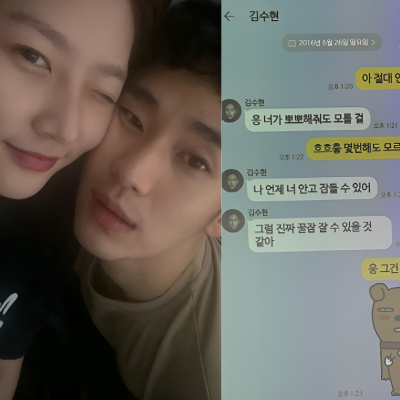
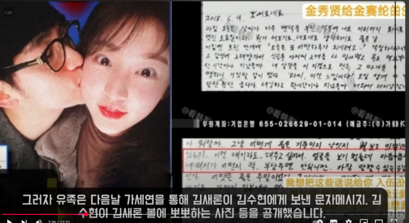
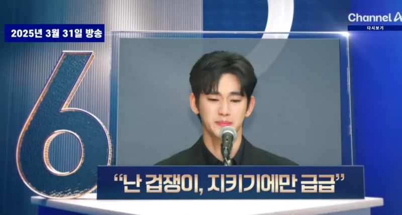
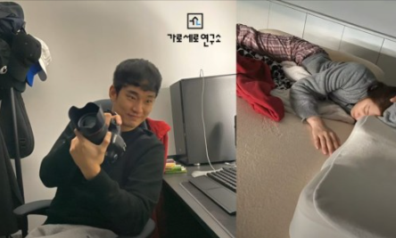
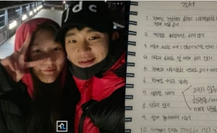
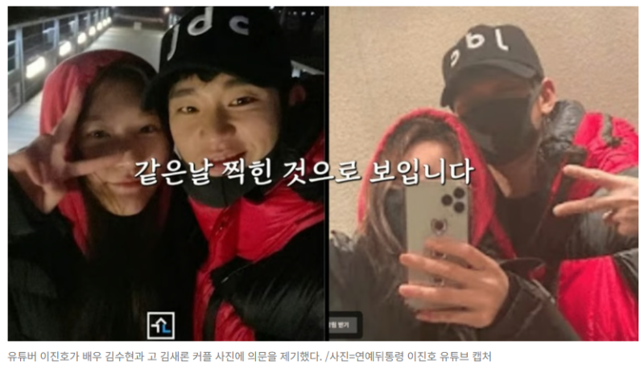
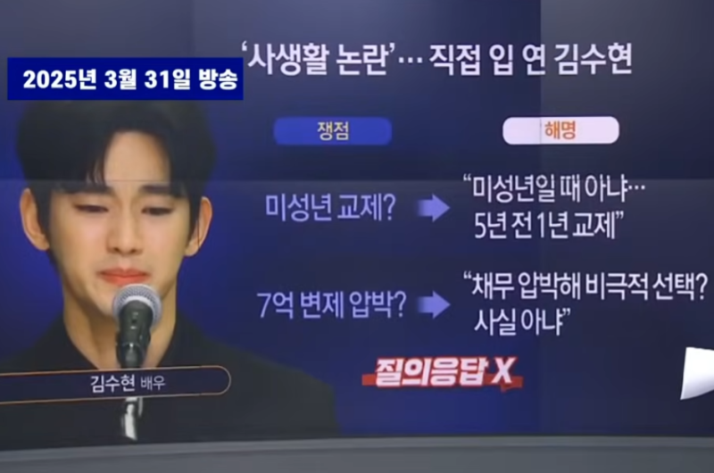

# "미성년 교제라더니"…김수현 김새론 카톡 논란, 뒤집힌 이유 (88의 흐름)

> 지나가다 봄 · 2026-05-21

원문: https://blog.naver.com/stonesam3/224292488816

> "17세 카톡 공개됐는데"

김수현 김새론 카톡 논란이 다시 뒤집혔다.

​

한쪽에서는 미성년 교제 증거라고 했고, 경찰은 조작 정황이라고 봤다.

같은 카톡인데 분위기가 완전히 갈렸다. 사람들이 계속 보는 이유도 거기다.

​

​

서울강남경찰서는 김세의 가로세로연구소 대표에 대한 구속영장 신청서에서 “김수현과 김새론의 미성년 시절 교제 주장은 허위라고 판단했다”고 적었다. 핵심은 카카오톡이었다.

경찰은 공개됐던 카톡 캡처 일부가 이름 수정 등 편집 과정을 거쳤다고 봤다. AI 음성 파일 역시 조작 가능성을 언급했다. 그러니까 사람들 입장에서는 갑자기 질문이 바뀐 거다.

“정말 교제였냐”보다

“대체 어디까지 사실이냐” 쪽으로.

​

​

문제의 카톡은 이미 너무 많이 퍼졌다. “언제 안고 잠들 수 있어” 같은 표현도 공개됐고, 당시 김새론 나이가 17세였다는 설명까지 붙었다.

그래서 대중 입장에서는 단순 루머처럼 안 보이는 것도 사실이다. 특히 유족 측은 “처음엔 교제 자체를 부인하다가 입장이 바뀌었다”고 주장했다.

이 지점이 계속 남는다.

카톡은 공개됐는데, 해석은 서로 정반대다.

​

김수현 측은 허위 사실 유포로 인한 피해를 강조하고 있다. 경찰 신청서에도 “사회적 기반과 경제 활동 전반이 무너질 수 있다”는 표현이 들어갔다.

실제로 광고, 이미지, 차기 작품 이야기까지 전부 연결되는 문제다. 그래서 이번 논란은 단순 열애설보다 훨씬 크게 번졌다.

조용한데 무겁다.

그런 분위기다.

​

​

▶김수현

김(1+5=6)+수(7)+현(9+2=11→2) : 15→6

김수현은 6 흐름이다. 6은 관계와 책임을 끝까지 붙드는 숫자로 많이 본다.

▶김새론

김(1+5=6)+새(7)+론(4+2=6) : 19→1

반대로 김새론은 1 흐름이 강하다. 감정보다 자기 방식대로 밀고 가는 힘이 센 타입.

▶관계 해석 : 6+1=7

1이름 : 6+6=12→3

2이름 : 7+7=14→5

3이름 : 2+6=8

​

1+2이름 : 3+5=8 그러면

근데 둘이 만나면 관계 중심엔 다시 7이 남는다. 7은 숨기고 버티는 흐름에 가깝다. 말보다 침묵이 길어지는 숫자.

묘한 건 여기서 8이 두 번 겹친다는 거다.

88 흐름은 감정보다 결과가 먼저 터지는 경우가 많다. 그래서인지 이번 논란도 사랑 이야기보다 카톡, 증거, 진술 쪽으로 계속 흘러간다.

※ 이 해석은 어디까지나 이름 흐름으로 읽은 이야기다.

​

​

카톡이 진짜였는가. 아니면 만들어진 흐름이었는가.

경찰은 조작 정황을 적었고, 유족 측은 실제 관계였다고 주장하고 있다.

아직 법원 판단이 끝난 것도 아니다. 근데 이미 대중 머릿속에는 “미성년 교제 논란” 자체가 강하게 남아버렸다.

그래서 더 묘하다.

해명이 나와도 끝난 느낌이 안 난다.

Q. 이번 김수현 김새론 논란에서 가장 오래 남은 장면은?

​

“언제 안고 잠들 수 있어” 카톡 공개

경찰의 AI 조작 판단

유족 측 기자회견

김수현 측 입장 변화 논란

※ 관련 내용은 서울강남경찰서 수사 및 공개 기사 내용을 바탕으로 정리했습니다.

※ 관련 글은 아래 링크 참고 ↘

​

#김수현
