# 법륜스님 구걸 소녀 "거절" 장면, 자비 논쟁 왜 커졌나(스님과 손님)

> 힐스터K · 2026-05-21

원문: https://blog.naver.com/tmzmfk010/224292257113

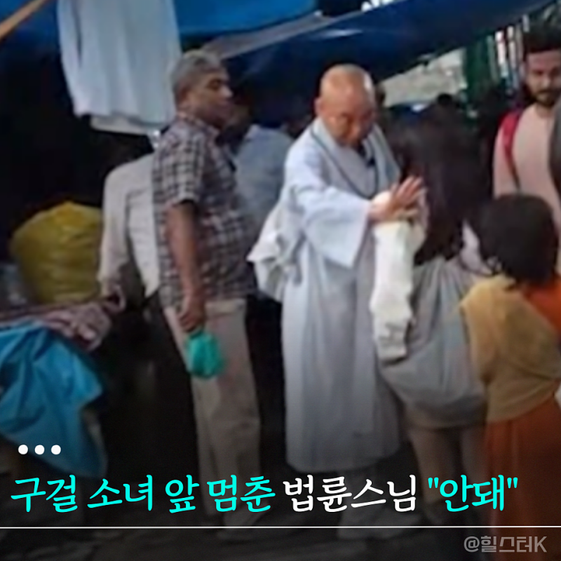

> 법륜스님 구걸 소녀 "거절" 장면, 자비 논쟁 왜 커졌나(스님과 손님)

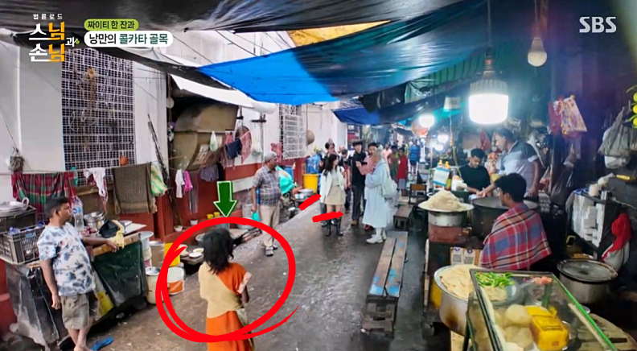

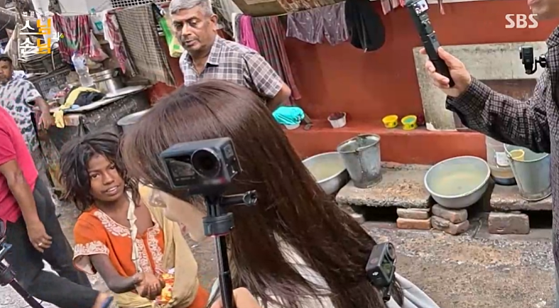

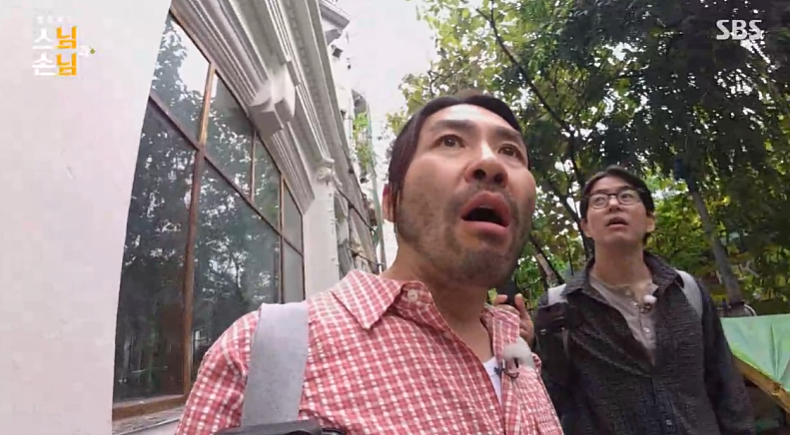

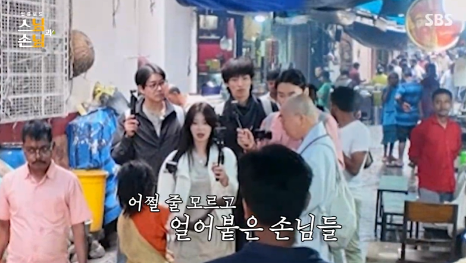

와... 5월 19일 화요일 첫 방송된 SBS "법륜로드 : 스님과 손님"은 예상보다 훨씬 묵직했다.

​

법륜스님, 노홍철, 이상윤, 이주빈, 이기택이 인도 콜카타를 걷는 장면은 여행 예능처럼 시작했지만, 구걸 소녀를 마주한 순간 분위기가 완전히 달라졌다.

이번 글에서는 "동정과 자비" 사이에서 흔들린 첫 회의 핵심 장면을 중심으로 살펴봤다.

인도 골목에서 멈춘 출연진의 시선

​

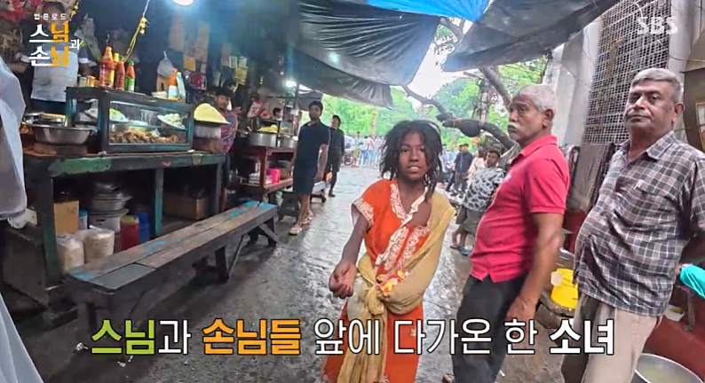

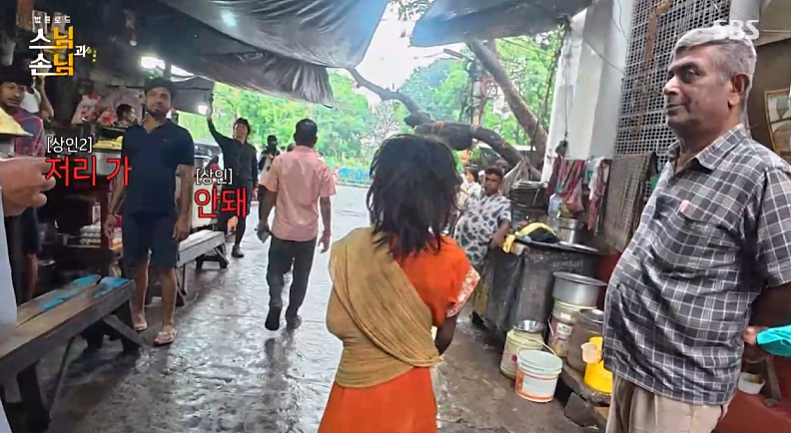

콜카타의 첫인상은 강했다. 5성급 호텔과 길거리 노숙 풍경이 한 화면 안에 놓였고, 출연진은 그 대비를 쉽게 받아들이지 못하는 듯 보였다. 특히 골목 시장에서 짜이를 마시던 중 어린 소녀가 손을 내미는 장면은 단순한 여행 에피소드라기보다, 보는 사람까지 순간 멈추게 하는 장면이었다.

이주빈의 울컥함이 먼저 닿은 이유

​

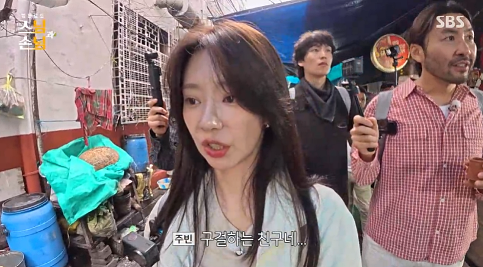

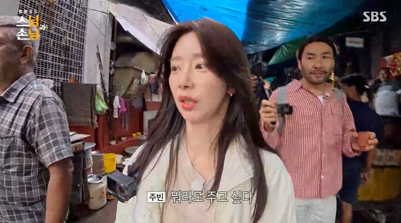

이주빈은 소녀의 눈을 마주하고도 어떻게 해야 할지 몰라했다. 뭐라도 주고 싶은 마음, 그런데 법륜스님과 현지 상인들이 제지하는 상황. 그 짧은 순간에 당황, 미안함, 불편함이 한꺼번에 지나간 듯했다. 아니... 왜 이렇게 마음이 걸리지? 싶은 장면이었다.

법륜스님의 단호함이 만든 논쟁

​

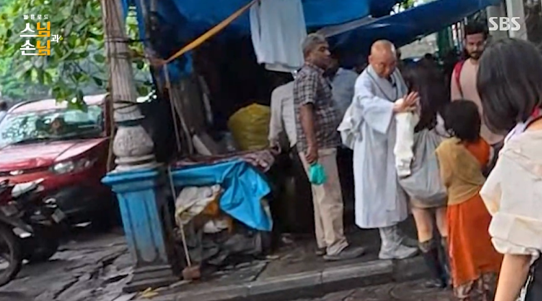

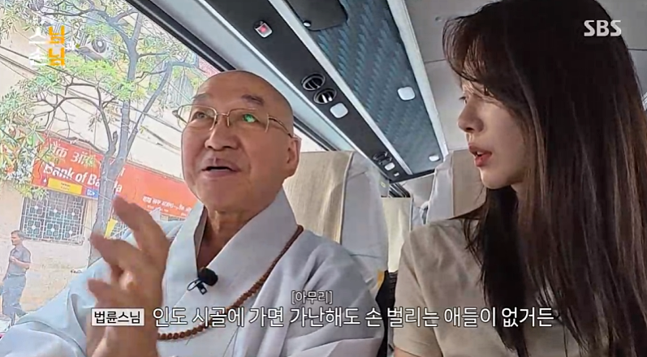

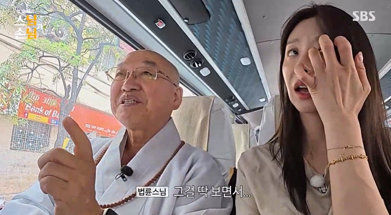

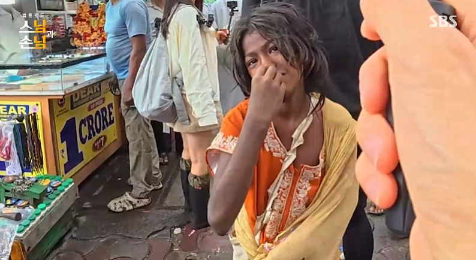

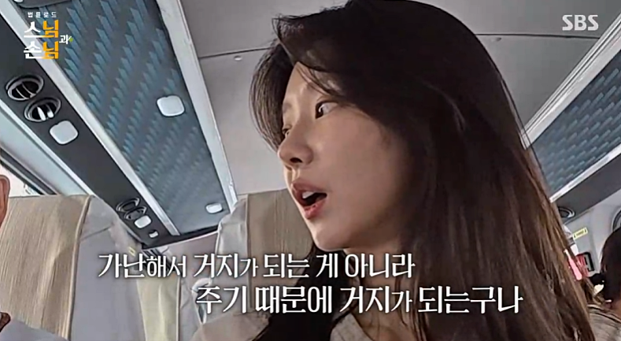

법륜스님은 돈을 주지 않는 이유를 설명했다. 가난해서 구걸하는 것이 아니라, 무분별하게 돈을 주는 구조가 아이들을 거리로 묶어둘 수 있다는 취지였다. 이 말은 차갑게 들릴 수도 있지만, 스님의 경험 안에서는 순간의 동정보다 장기적인 자립을 생각한 판단으로 읽혔다. 그래서 더 논쟁적이었다.

예능이 던진 뜻밖의 질문

​

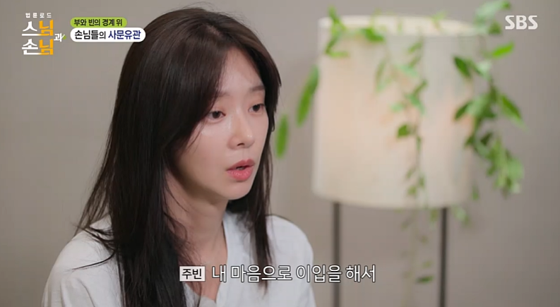

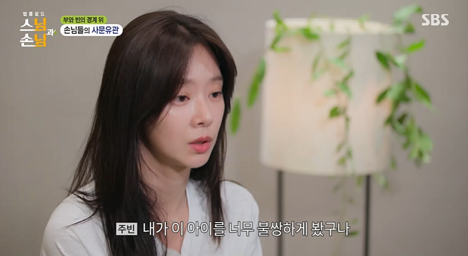

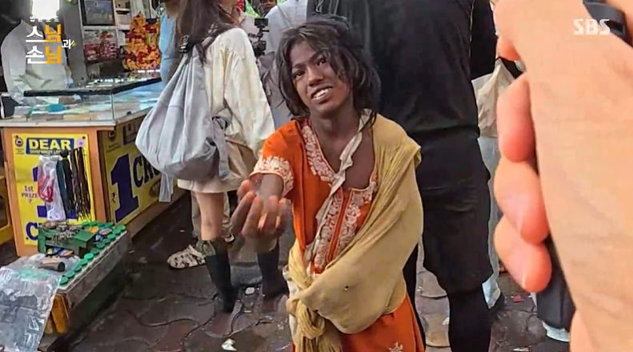

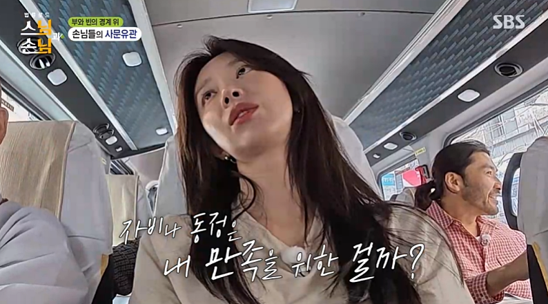

"법륜로드" 첫 회는 웃음보다 질문이 남은 방송이었다. 노홍철은 순간의 당황스러움을 질문으로 바꿨고, 이상윤은 화려함과 가난이 함께 놓인 풍경을 묵묵히 바라봤다. 이주빈은 자신의 동정심까지 되돌아봤다. 각자의 반응이 달라서 오히려 이 장면은 더 현실적으로 다가왔다.

다음 회차가 더 궁금해진 이유

​

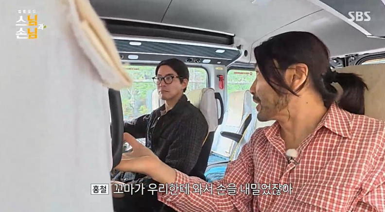

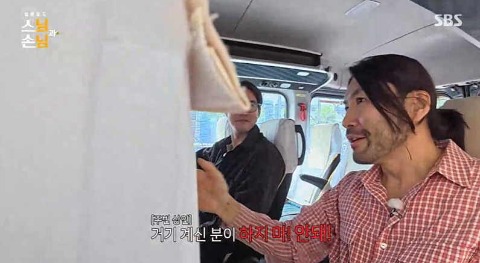

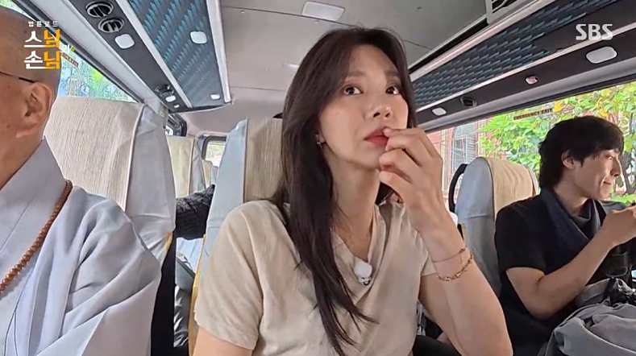

법륜스님은 방향을 제시했고, 노홍철은 질문을 던졌고, 이주빈은 감정으로 흔들렸고, 이상윤은 조용히 관찰했다. "법륜로드 : 스님과 손님"은 5월 26일 화요일 밤 9시 2회로 이어진다. 다음 여정에서는 또 어떤 현실이 묵직한 질문처럼 다가올까?

​

#법륜로드

​
