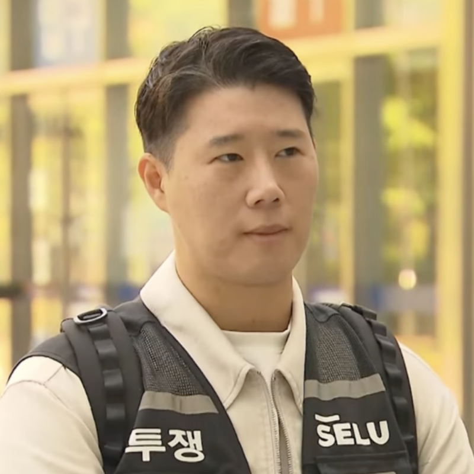

# "삼성채용 학벌컷 있다더니..." 삼성 노조위원장 의외의 학력

> 엘라이프 · 2026-05-18

원문: https://blog.naver.com/yeji2552/224289615297

안녕하세요

여러분의 영어성장을 도와드리는 엘라입니다 :)

​

오늘은 삼성 학벌컷 있다더니

노조위원장 의외의 학력에 대해

솔직하게 정리해서 알려드릴게요

> 삼성 학벌컷 있다더니...
> 
> 노조위원장 학력이 여기였어?

이번 삼성전자 노조 위원장 최승호 씨는

명지대 산업공학과 출신이라고 해요

​

우리가 흔히 삼성 직원이라고 하면

SKY라든가 카이스트, 포스텍 정도로 생각하는데

명지대 산공과라니 좀 의외죠?

삼성도 이젠 학벌만 보지 않고

결국 본인이 그 안에서 도대체 어떻게 일했느냐라는가

어떤 가치를 만들었느냐가 진짜 핵심이라는 거죠

> 심지어 부위원장 학력은 더 의외라고?

부위원장 이송이 씨는 심지어 광주공고 출신이에요

실제로 이송이 씨는 '삼성을 없애버리겠다는 말'까지

사람으로 알려져 있는 강성 노조 성향이에요

​

고졸 출신이 삼성전자 노조 부위원장이라니

삼성이 진짜 다양한 출신을 채용한다는

진짜 증거인 거 같아요

참고로 명지대 산업공학과는

자연계열 일반 학과로 입결이 보통

내신 기준 3등급에서 형성돼요

산업공학은 실용적인 학과라

공정 관리라든가 품질 관리, 생산 최적화까지 다 배워요

삼성 같은 제조업에서 진짜 활용도가 높은 학과죠

> 그래서 삼성 채용에 강한 대학은 어디일까?

​

1티어

서울대, 카이스트, 포스텍

2티어

연세대, 고려대, 성균관대, 한양대

특히 성균관대 반도체시스템공학과랑

한양대 컴공은 계약학과 때문에 입사 보장이에요

3티어

서강대, 중앙대, 경희대, 한국외대, 서울시립대

인서울 중상위권이지만 삼성 합격률이 높아요

그리고 요즘 진짜 핫한 학과는

반도체공학과라든가 AI/인공지능학과,

컴퓨터공학과, 데이터사이언스학과예요

이쪽 학과는 대학 라인이 살짝 떨어져도

삼성 취업에 강해요

<Next: 함께 보면 좋은 정보>

인서울 대학 순위, 취업률로 갈린 하위권 마지노선

2026 공대 대학 순위, 최신 입결이 갈라놓은 현실

"우리 딸, 의사 안 부럽네" 2026 돈 많이 버는 여자 직업

"서성한 중경외시?" 10년 뒤엔 대학 서열 바뀐다
