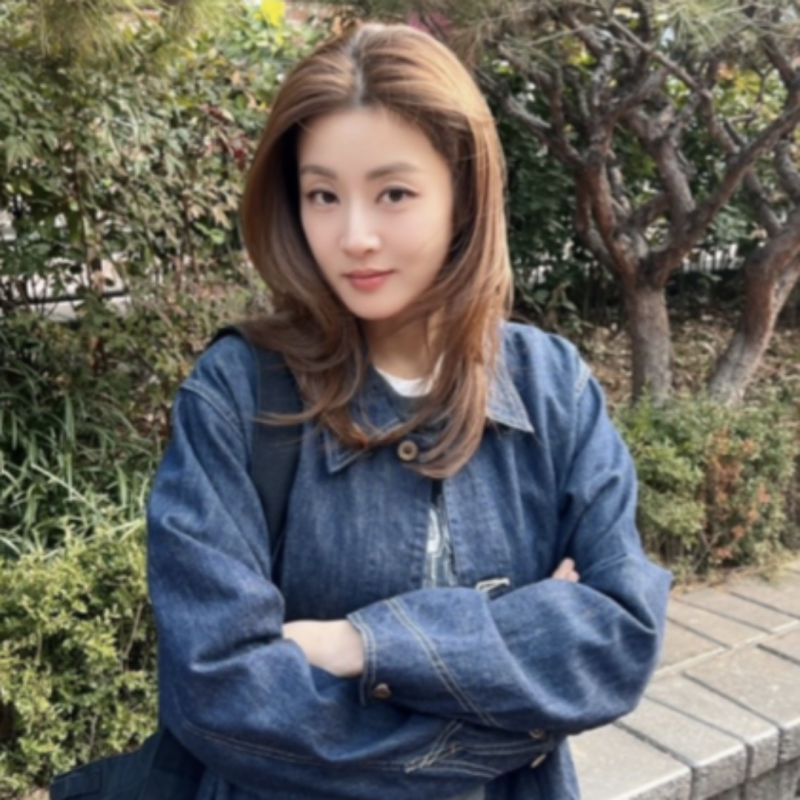

# "외고 출신 -> 연세대학교" 의외로 공부 잘했던 엘리트 연예인 TOP5

> 엘라이프 · 2026-05-21

원문: https://blog.naver.com/yeji2552/224292463309

안녕하세요

여러분의 영어성장을 도와드리는 엘라입니다 :)

​

오늘은 외고 출신에 명문대까지 입학한

공부 잘했던 엘리트 연예인에 대해

정리해서 알려드릴게요

> 외고 출신 -> 연세대까지
> 
> 엘리트 연예인 누가 있을까?

피프티피프티 문샤넬

아이돌 피프티피프티 문샤넬 씨는

사실 연세대 바이오생활공학과 출신이라고 해요

​

아이돌 되기 전에는 의사가 되고 싶었을 정도로

공부를 잘했다고 해요

그땐 아이돌은 너무 먼 꿈같아서

진짜 열심히 공부해서 연세대까지 합격했다고 해요

박규영

배우 박규영 씨는 1993년생으로

외고를 거쳐서 연세대 의류환경학과를 졸업했다고 해요

외고 -> 연세대 정통 엘리트 코스를 제대로 밟은 거죠

연세대 의류환경학과는 패션 디자인이라든가

의류 환경, 환경까지 진짜 유명한 학과예요

키키 지유

요즘 핫한 아이돌 키키 지유는

사실 부산외국어고등학교 출신이라고 해요

심지어 바둑을 7년 넘게 해서

시장배 대회에 나가서 준우승까지 할 정도로

남다른 실력자라고 해요

부산외고는 부산 지역 최상위권 외고로

엄청난 학구열로 유명한 학교예요

엔믹스 해원

엔믹스 해원 씨는 학창 시절에 외고 준비를

했었다고 해요! 학창 시절에 주로 수학이라든가

과학, 영어 학원, 독서 토론 논술 학원을 다녔다고 해요

​

물론 아이돌 활동하느라 외고를 가진 못 했지만

어렸을 때부터 똑똑했었다고 해요

강소라

배우 강소라 씨는 중학교 3학년 때까지

외고 준비를 했다고 해요

연극부 활동하면서 연기학원을 찾았는데

연기학원 원장님이 '아까우니까 공부를 하라고

학원 등록을 말리기도 했대요'

심지어 강소라 씨 엄마한테 이렇게까지 말했다고 해요

'왜 따님을 힘든 길을 시키려고 하냐

중학교 3학년 때까지 외고 준비하셨다면서요,

진짜 공부 시키세요'

> 요즘 연세대 입결은 이 정도라고?

연세대 입결은 인문계 평균 95-97이고

자연계열은 96-98까지도 가요!

​

거기다 연세대 바이오생활공학과는

인기 학과로 정시 백분위 96 이상이에요

이공계열이라 진짜 만만한 학과가 절대 아니에요

연세대 의류환경도 정시 백분위 94-96 수준이고요

수시 학생부 종합전형은

내신 1점대 초반 학생분들만 도전 가능해서

정말 공부 잘한 학생들만 입학할 수 있는 곳이에요

<Next: 함께 보면 좋은 정보>

인서울 대학 순위, 취업률로 갈린 하위권 마지노선

2026 공대 대학 순위, 최신 입결이 갈라놓은 현실

"우리 딸, 의사 안 부럽네" 2026 돈 많이 버는 여자 직업

"서성한 중경외시?" 10년 뒤엔 대학 서열 바뀐다
