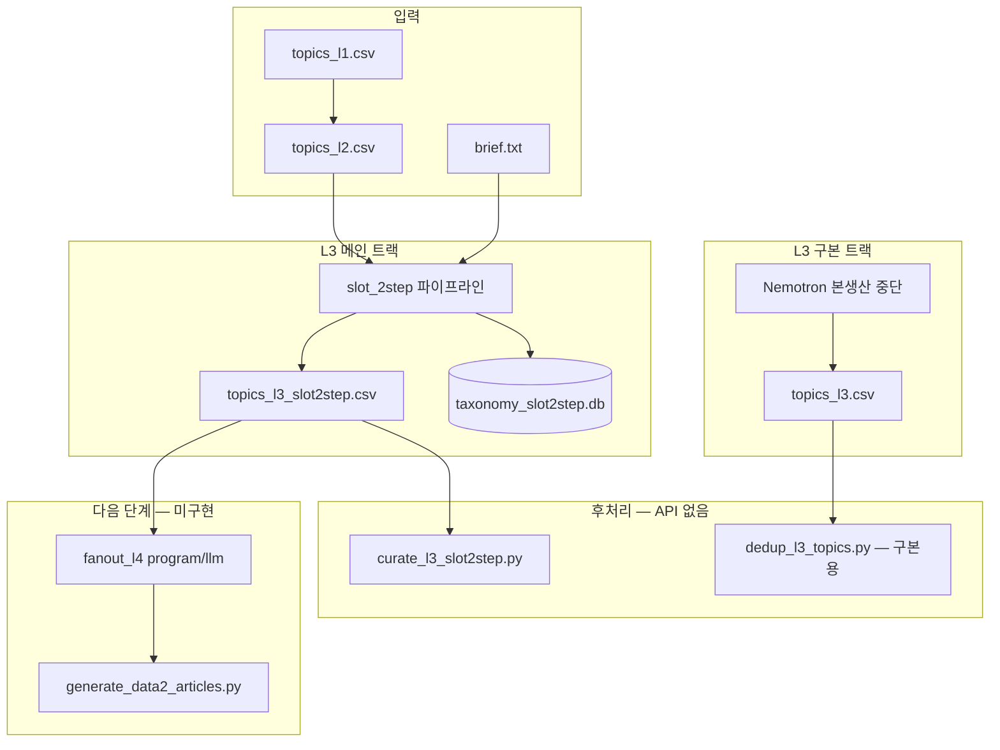

# data2 택소노미 시스템 — 현재 구현 개요

> **작성일**: 2026-06-10  
> **대상 독자**: 새 세션·외부 검토(Claude 등)·다른 Cursor 환경  
> **목적**: 지금 돌아가는 시스템이 무엇인지, 무엇이 끝났고 무엇이 다음인지 한 문서로 파악

**관련 문서**

| 문서 | 용도 |
|------|------|
| [data2-taxonomy-master-plan.md](./data2-taxonomy-master-plan.md) | 설계·100만 KW 로드맵 (일부 스냅샷 구식) |
| [data2-l3-slot2step-runbook.md](./data2-l3-slot2step-runbook.md) | L3 재개 명령 (일부 스냅샷 구식) |
| [data2-taxonomy-handoff.md](./data2-taxonomy-handoff.md) | 구현 인수인계 히스토리 |
| **본 문서** | **현재 시스템 단일 소스 (2026-06-10)** |
| [prompts/claude-taxonomy-review.md](./prompts/claude-taxonomy-review.md) | **Claude 검토용 프롬프트** (복사·첨부 가이드) |
| [**data2-l3-claude-handoff.md**](./data2-l3-claude-handoff.md) | **L3 claude_direct 재생성 인계** (배치 통합, 최신) |

---

## 1. 프로젝트가 하는 일

네이버형 **대량 SEO 블로그**를 위한 키워드·택소노미 파이프라인.

| 목표 | 수치 |
|------|------|
| KW **창고** (L4 fan-out 포함) | ~100만 |
| 실제 **발행 URL** | 10만~30만 |
| 품질 | stem·의도 기준 중복 최소, 템플릿 도배 방지 |

**계층**

```
L1 (14) → L2 (603) → L3 시드 (~15/L2) → L4 롱테일 (program/llm/hybrid) → 본문
```

---

## 2. 현재 데이터 스냅샷 (2026-06-10)

| 레벨 | 파일 | 행/L2 | 상태 |
|------|------|-------|------|
| L1 | `data2/seed/topics_l1.csv` | 14 | ✅ 고정 |
| L2 | `data2/topics_l2.csv` | **603** | ✅ 확장 완료 |
| **L3 메인** | **`data2/topics_l3_slot2step.csv`** | **5,805 / 393 L2** | ✅ 생성·curate 완료 |
| L3 구본 | `data2/topics_l3.csv` | 11,099 / 210 L2 | 📦 Nemotron 아카이브 |
| L4 | — | 0 | ❌ 미시작 |
| 본문 | `data2/answers/body/` | 10건 샘플 | 파일럿 |

### L3 603 L2 커버리지

```
L2 603
├── topics_l3.csv (구본)           210 L2 — 과거 Nemotron, 본생산에 섞지 않음
└── topics_l3_slot2step.csv (메인) 393 L2 — slot_2step cap 15
    └── missing L2: 0 (두 파일 합집합 = 603)
```

### slot2step L3 품질 상태

| 항목 | 값 |
|------|-----|
| L2당 15 초과 | **0** (curate 후) |
| L2당 15 미만 | **62** (stem dedup 여파, topup 가능) |
| curate 제거 | 499행 → `data2/archive/topics_l3_slot2step_dropped.csv` |

---

## 3. 아키텍처 — 3트랙



### 핵심 정책 (반드시 지킬 것)

1. **L3 메인은 `topics_l3_slot2step.csv`만** — 구본 `topics_l3.csv`와 merge 금지 (L2 집합이 다름).
2. **L2당 L3 cap = 15** — merge 시 코드에서도 cap 적용 (`pilot_l3_review_batch.py`).
3. **L4 1개 = primary KW 1개** — intent×angle 기계 곱으로 URL量만 늘리지 않음.
4. **YMYL L1 (02 경제, 03 건강)** — hold·면책 강화.

---

## 4. L3 slot_2step 파이프라인 (핵심)

**메인 스크립트**: `scripts/pilot_l3_review_batch.py`  
**코어 로직**: `scripts/test_l3_diversity.py`

### 4단계

| 단계 | 담당 | 설명 |
|------|------|------|
| 1 | Groq **Scout** | L2당 검색 의도 **슬롯** N개 생성 |
| 2 | **Gemini** lite | 슬롯 stem 중복 제거 |
| 3 | Groq **Scout** | 슬롯 1개당 L3 1개 (focus_keyword, title, slug…) |
| 4 | **코드** | `filter_diverse()` — stem, suffix, intent×angle cap |

### 모델·환경

| 역할 | 모델 | env |
|------|------|-----|
| Scout | `meta-llama/llama-4-scout-17b-16e-instruct` | `GROK_API_KEY_3`, `_4` (`GROQ_USE_KEYS=3,4`) |
| Gemini dedup | `gemini-3.1-flash-lite` | `GEMINI_API_KEY` |
| CSV `model` 컬럼 | `slot_2step` | 행별 Scout/Gemini 구분 없음 |

### API 한도 (실측, Free tier)

| 리소스 | 한도 | 429 의미 |
|--------|------|----------|
| Groq Scout | TPD 500K 토큰/키/일, RPM 30 | **TPD 소진**이 흔함 (호출 수 한도 아님) |
| Gemini lite | ~500/일 | dedup용 소량 |

### 주요 CLI

```bash
# 신규 L2 본생산 (현재 missing=0, 완료)
.venv/bin/python scripts/pilot_l3_review_batch.py \
  --missing-l2 --merge-topics --resume --groq-keys 3,4

# cap 미만 L2 부족분 (62 L2, ~90 L3)
.venv/bin/python scripts/pilot_l3_review_batch.py \
  --topup-under 15 --merge-topics --groq-keys 3,4

# L3 정리 (LLM 없음, cap 15)
.venv/bin/python scripts/curate_l3_slot2step.py
```

`--max-scout`는 TPD 전 인위 중단용. **한도까지 쓰려면 생략.**

---

## 5. L3 행 스키마

`scripts/taxonomy_state.py` → `L3_FIELDNAMES`:

```
l3_id, l2_id, l1_code, l3_slug, focus_keyword, title_ko,
search_intent, topic_angle, description, model, generated_at
```

- `l3_id` = `{l2_id}-{slug}` (slug 충돌 시 `-2` suffix)
- `search_intent`: info | howto | compare | checklist | news …
- `topic_angle`: tip | howto | local | start | issue …

---

## 6. 스크립트 인덱스

### L3 — 활성

| 스크립트 | 역할 |
|----------|------|
| **`pilot_l3_review_batch.py`** | L3 본생산·topup·merge·checkpoint |
| **`test_l3_diversity.py`** | slot_2step 코어 (슬롯·fill·filter) |
| **`curate_l3_slot2step.py`** | slot2step CSV dedup+cap → DB 반영 |
| `groq_client.py` | Groq 키 로테이션, 429 TPD/RPM 파싱 |
| `gemini_client.py` | Gemini chat, JSON parse |
| `taxonomy_state.py` | SQLite, upsert, export_artifacts |

### L3 — 레거시/참고

| 스크립트 | 역할 |
|----------|------|
| `generate_taxonomy_l3.py` | 초기 Nemotron/Scout 배치 (구본용) |
| `dedup_l3_topics.py` | **구본** `topics_l3.csv` curate |
| `nvidia_client.py` | Nemotron NIM 클라이언트 |

### L2

| 스크립트 | 역할 |
|----------|------|
| `generate_taxonomy_l2.py` | L2 초기 생성 |
| `expand_taxonomy_l2.py` | 210→603 확장 |

### L4·본문 — 계획만 있음

| 스크립트 | 역할 |
|----------|------|
| `export_phase1_pilot.py` | Phase1 25 L2 발행 큐 |
| `generate_data2_articles.py` | Gemini 본문 생성 |
| `fanout_l4_geo.py` | **미구현** (마스터 플랜 Phase 0) |

### Phase1 계획 데이터

- `data2/pilot/phase1_l3_l4_plan.csv` — 25 L2, L3 cap 304, L4 창고 ~1만

---

## 7. 디렉터리 — canonical vs 아카이브

### 지금 쓰는 것 (canonical)

```
data2/
├── topics_l2.csv
├── topics_l3_slot2step.csv      ← L3 메인 (5,805)
├── topics_l3_slot2step.json
├── manifest_l3_slot2step.json
├── brief.txt
├── state/taxonomy_slot2step.db
├── pilot/phase1_l3_l4_plan.csv
└── reports/l3_slot2step_curate_report.json
```

### 구본·히스토리 (섞지 말 것)

```
data2/
├── topics_l3.csv                 ← 210 L2 Nemotron
├── topics_l3_curated.csv         ← 구본 dedup 결과 (slot2step 무관)
├── topics_l3_hold.csv
├── topics_l3_dropped.csv
├── state/taxonomy.db             ← Nemotron 시대 DB
├── state/l3_slot2step_*_checkpoint.json  ← 본생산/topup 완료, 아카이브 후보
├── test/                         ← A/B·파일럿 (발행 DB 아님)
└── archive/topics_l3_slot2step_dropped.csv
```

---

## 8. 완료 vs 다음

### ✅ 완료

- L2 603 확장
- L3 slot2step 393 L2 생성 (`missing_l2 = 0`)
- L3 curate (cap 15, over-cap 0)
- Groq 키 로테이션·429 리포트
- topup 모드 (`--topup-under 15`)

### ⏳ 선택·잔여

- 62 L2 L3 topup (~90건)
- 구본 210 L2 → slot2step 재생성 여부 (미결)
- checkpoint·logs·test → `archive/` 정리 (미실행)
- 마스터 플랜·런북 §1 스냅샷 갱신

### ❌ 다음 메인

1. **`fanout_l4_geo.py`** — Phase1 25 L2, 창고 ~1만부터
2. **본문 파일럿** — `export_phase1_pilot.py` → `generate_data2_articles.py`
3. **100만 경로** — L4 program + `keyword/es` 엔티티

### L4 규모 추정 (현 L3 기준)

| 범위 | 예상 L4 창고 |
|------|----------------|
| Phase1 25 L2 | ~1만 |
| slot2step 393 L2 | ~17만~20만 |
| 603 L2 전체 | ~35만~40만 |
| + ES 엔티티 | 80만~120만 (목표) |

---

## 9. 알려진 이슈·기술 부채

| 이슈 | 설명 |
|------|------|
| 문서 스냅샷 구식 | handoff·runbook·master-plan §1이 84 L2 시점 |
| 2트랙 L3 | 통합 CSV 없음 — 의도적 분리 |
| 구본 curated 3종 | `topics_l3.csv` 기준, slot2step과 혼동 주의 |
| `generate_taxonomy_l3.py` | pilot이 메인; 구 스크립트 문서 정리 필요 |
| L4 미구현 | 100만 KW의 본체 아직 없음 |
| JSON 5MB+ | CSV 미러; export 정책 미정 |

---

## 10. 외부 검토(Claude)용 — 꼭 볼 것

아래를 기준으로 **설계·데이터·리스크**를 검토하면 됩니다.

### A. 아키텍처 적합성

1. **L3 15 cap + slot_2step**이 네이버 SEO 시드로 충분한가?
2. **2트랙 분리**(393 slot2step + 210 Nemotron)가 L4·발행 큐에서 문제 없는가?
3. **L4 program / llm / hybrid** 분기 설계(`phase1_l3_l4_plan.csv`)가 타당한가?

### B. 품질·중복

1. `filter_diverse()` + `curate_l3_slot2step.py` 이중 dedup이 과한/부족한지
2. curate 후 **62 L2가 15 미만** — topup vs 그대로 fan-out
3. stem·`_keyword_seen()` 유사도가 한국어 롱테일에 맞는지

### C. 운영·API

1. Groq **TPD 키 로테이션** 전략 (2키/일, 429 시 중단)
2. Gemini dedup 실패 시 Scout-only 폴백 구간 품질
3. checkpoint·resume·merge **idempotency** (과거 over-cap 버그 수정됨)

### D. 다음 단계 우선순위

1. L4 geo program vs L3 topup 90 vs 문서 정리 — 어떤 순서가 맞는가?
2. Phase1 **~1만 L4**로 검증 후 전체 fan-out vs 393 L2 일괄 fan-out
3. 발행 10만~30만 목표 대비 **curate/tier** 파이프라인 (`dedup_l3_topics.py` 재사용 vs 신규)

### E. 리스크

| 리스크 | 완화 |
|--------|------|
| YMYL (02·03) | hold·edit tier, 면책 |
| cannibalization | L2당 15, stem dedup |
| 창고 vs 발행 혼동 | tier·publish_l3_cap (Phase1 계획) |
| API 정지 | 429 수용, 키 우회·계정 쪼개기는 비권장 |

### F. 검토 시 제공할 파일 (최소 세트)

```
docs/data2-system.md                    ← 본 문서
data2/topics_l3_slot2step.csv           ← L3 메인 (5,805)
data2/topics_l2.csv                     ← L2 603
data2/pilot/phase1_l3_l4_plan.csv       ← L4 계획
scripts/pilot_l3_review_batch.py        ← L3 오케스트레이션
scripts/test_l3_diversity.py            ← slot_2step 코어
scripts/curate_l3_slot2step.py          ← L3 후처리
docs/data2-taxonomy-master-plan.md      ← 100만 KW 설계 (§8 L4)
```

구본 비교가 필요하면 추가: `data2/topics_l3.csv`, `data2/archive/topics_l3_slot2step_dropped.csv`

---

## 11. Claude에게 넘길 때 한 줄 요약

> **603 L2 SEO 택소노미 파이프라인.** L3 메인 5,805행(slot_2step, 393 L2) 생성·curate 완료. L4 fan-out·본문 미시작. 다음은 Phase1 기준 L4 program 프로토타입(~1만 KW)과 발행 검증. 구본 11,099행(Nemotron 210 L2)은 별도 아카이브.

---

*갱신: L3·L4 마일스톤 변경 시 §2·§8·§11을 먼저 수정할 것.*
